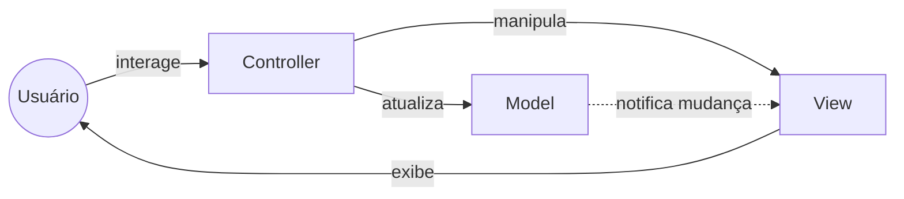
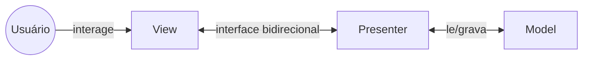
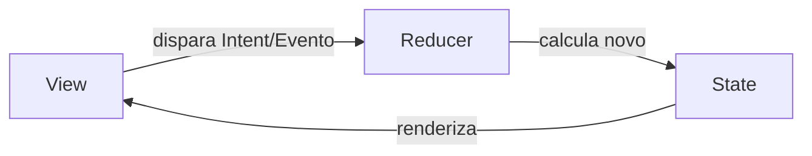
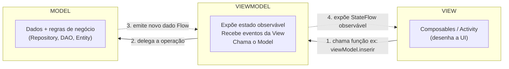
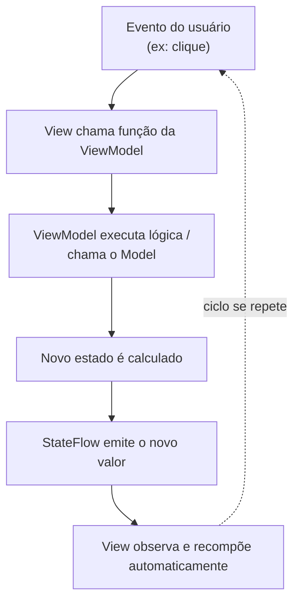
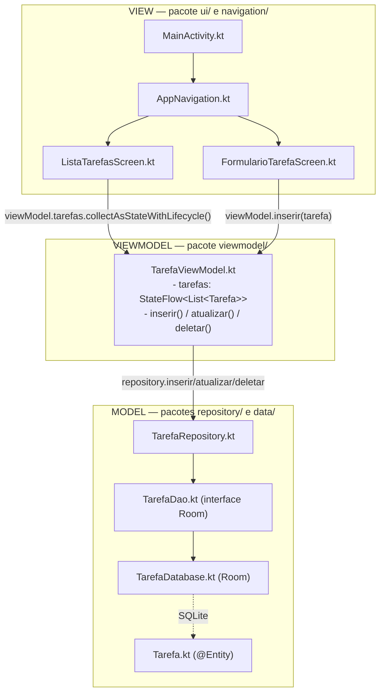
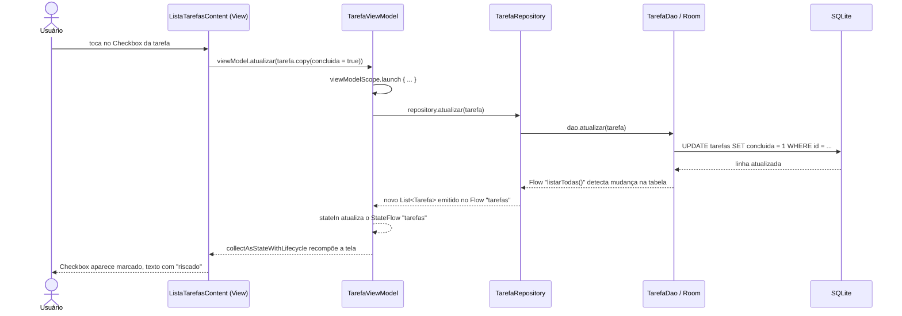

# Arquitetura MVVM — Material Didático

**Projeto:** FIAP To-Do List
**Público-alvo:** alunos de 3º ano de Sistemas de Informação (FIAP)
**Objetivo:** entender o que é um padrão arquitetural, comparar as opções mais comuns (MVC, MVP, MVI) e aprofundar no **MVVM**, mostrando como cada peça do padrão aparece no código real deste projeto.

---

## Sumário

1. [Por que usar um padrão arquitetural?](#1-por-que-usar-um-padrão-arquitetural)
2. [Panorama rápido: MVC, MVP e MVI](#2-panorama-rápido-mvc-mvp-e-mvi)
3. [MVVM em profundidade](#3-mvvm-em-profundidade)
4. [MVVM aplicado ao projeto](#4-mvvm-aplicado-ao-projeto)
5. [Passo a passo: o que acontece quando o usuário marca uma tarefa como concluída](#5-passo-a-passo-o-que-acontece-quando-o-usuário-marca-uma-tarefa-como-concluída)
6. [Por que não usamos Hilt/Koin?](#6-por-que-não-usamos-hiltkoin)
7. [Vantagens do MVVM neste projeto](#7-vantagens-do-mvvm-neste-projeto)
8. [Comparando os padrões lado a lado](#8-comparando-os-padrões-lado-a-lado)
9. [Perguntas para fixação](#9-perguntas-para-fixação)

---

## 1. Por que usar um padrão arquitetural?

Um padrão arquitetural é simplesmente **um jeito combinado de organizar responsabilidades** no código. Sem ele, é comum um app Android acabar assim:

```
Activity/Composable
 ├─ desenha a tela
 ├─ acessa o banco de dados diretamente
 ├─ guarda o estado da tela em variáveis soltas
 └─ decide as regras de negócio
```

Tudo misturado numa única classe. Funciona para um protótipo pequeno, mas rapidamente vira um arquivo de milhares de linhas, difícil de testar (não dá pra testar lógica sem abrir a tela) e difícil de manter (mexer numa coisa quebra outra).

Um padrão arquitetural separa o código em **camadas com responsabilidade única**:

- **Quem desenha a tela** não deveria saber como os dados são salvos.
- **Quem guarda os dados** não deveria saber como a tela é desenhada.
- **Alguém no meio** conecta as duas pontas.

MVC, MVP, MVI e MVVM são só variações diferentes de "como dividir essas responsabilidades e como conectar as pontas".

---

## 2. Panorama rápido: MVC, MVP e MVI

### 2.1 MVC (Model-View-Controller)

O padrão mais antigo (décadas de uso, veio do Smalltalk nos anos 70). Três peças:

- **Model**: dados e regras de negócio.
- **View**: exibe os dados na tela.
- **Controller**: recebe as ações do usuário, decide o que fazer e atualiza a View e o Model.



**Problema clássico no Android:** a `Activity`/`Fragment` acaba fazendo o papel de View **e** de Controller ao mesmo tempo — ela recebe cliques, decide o que fazer e desenha a tela. Isso gera as famosas "God Activities" (Activities gigantes que fazem de tudo) e dificulta muito os testes automatizados, porque a lógica de negócio está presa a uma classe do Android que só roda com um dispositivo/emulador.

### 2.2 MVP (Model-View-Presenter)

Evolução do MVC pensada para separar melhor a lógica de apresentação. A View vira "burra" (só desenha o que mandarem) e delega toda decisão a um **Presenter**:



O Presenter conhece a View através de uma **interface** (`interface TarefaView { fun mostrarLista(...) }`), o que permite testar o Presenter isoladamente com uma View "falsa" (mock). O ponto fraco: como a comunicação View ↔ Presenter é bidirecional e manual, cresce muito código repetitivo ("boilerplate") — cada tela nova exige uma interface nova e métodos de ida e volta.

### 2.3 MVI (Model-View-Intent)

Padrão mais recente, popular em apps reativos (Compose, Kotlin Flow). Baseado em **fluxo de dados unidirecional** e estado imutável:



A ideia central: a tela nunca mexe direto no estado — ela só dispara "intenções" (ex: `Intent.MarcarConcluida(tarefa)`), um reducer processa e devolve um **novo** objeto de estado imutável, e a View apenas re-renderiza a partir desse estado. É muito previsível e fácil de depurar (dá pra logar cada estado e "voltar no tempo"), mas exige mais estrutura (classes de Intent, Reducer, State) — overhead que não compensa para um app didático pequeno como este.

---

## 3. MVVM em profundidade

**MVVM = Model-View-ViewModel.** Criado pela Microsoft (WPF) e adotado amplamente no Android depois que o Google lançou a biblioteca `ViewModel` do Jetpack. Três camadas:



O detalhe que diferencia o MVVM do MVP: **a ViewModel não conhece a View**. Não existe uma interface `TarefaView` sendo injetada no ViewModel. Em vez disso, a ViewModel expõe um **estado observável** (aqui, um `StateFlow`), e a View se inscreve (observa) nesse estado. Quando o estado muda, a View é notificada automaticamente e se redesenha sozinha — sem que a ViewModel precise saber que a View existe.

Essa é a ideia de **fluxo de dados unidirecional (Unidirectional Data Flow — UDF)**:



Os dados sempre "descem" da ViewModel para a View através de observação, e as ações sempre "sobem" da View para a ViewModel através de chamadas de função. Nunca o contrário — a View nunca modifica o Model diretamente, e a ViewModel nunca manipula Views/Composables diretamente.

Outra vantagem específica do Android: a `ViewModel` do Jetpack **sobrevive a mudanças de configuração** (como girar a tela). Se toda a lógica e o estado estivessem dentro da Activity/Composable, girar o celular destruiria e recriaria tudo, perdendo o estado. Como o estado mora na ViewModel (que o Android preserva), a tela é recriada mas os dados continuam lá.

---

## 4. MVVM aplicado ao projeto

Este é o mapeamento **real** das camadas para os arquivos do projeto:



### 4.1 Model — dados e regras

O **Model** é composto por quatro peças, cada uma com uma responsabilidade bem definida:

**`Tarefa.kt`** — a entidade, o "formato" de uma tarefa no banco:

```kotlin
@Entity(tableName = "tarefas")
data class Tarefa(
    @PrimaryKey(autoGenerate = true) val id: Int = 0,
    val titulo: String,
    val descricao: String,
    val concluida: Boolean = false,
    val dataCriacao: Long = System.currentTimeMillis(),
    val dataHora: Long? = null
)
```

**`TarefaDao.kt`** — o contrato de acesso ao banco (o Room gera a implementação automaticamente a partir da interface):

```kotlin
@Dao
interface TarefaDao {
    @Query("""
        SELECT * FROM tarefas
        ORDER BY dataHora IS NULL, dataHora ASC, dataCriacao DESC
    """)
    fun listarTodas(): Flow<List<Tarefa>>

    @Insert
    suspend fun inserir(tarefa: Tarefa)

    @Update
    suspend fun atualizar(tarefa: Tarefa)

    @Delete
    suspend fun deletar(tarefa: Tarefa)
}
```

Repare que `listarTodas()` devolve um `Flow<List<Tarefa>>` — um "fluxo" que emite uma nova lista automaticamente toda vez que a tabela `tarefas` muda. Ninguém precisa pedir "atualiza a lista pra mim"; o Room já observa o banco e emite sozinho.

**`TarefaDatabase.kt`** — configura o banco Room e garante que só existe **uma instância** dele no app inteiro (padrão *Singleton*, via `companion object` + `@Volatile`).

**`TarefaRepository.kt`** — a camada que a ViewModel efetivamente usa. Ela existe para isolar a ViewModel de detalhes do Room:

```kotlin
class TarefaRepository(private val dao: TarefaDao) {
    val tarefas: Flow<List<Tarefa>> = dao.listarTodas()
    suspend fun inserir(tarefa: Tarefa) = dao.inserir(tarefa)
    suspend fun atualizar(tarefa: Tarefa) = dao.atualizar(tarefa)
    suspend fun deletar(tarefa: Tarefa) = dao.deletar(tarefa)
}
```

Hoje o Repository só repassa as chamadas para o DAO — parece redundante. Mas é essa camada que permitiria, por exemplo, trocar o Room por uma API remota no futuro **sem que a ViewModel precise mudar uma linha**, porque a ViewModel só conhece o Repository, nunca o Room diretamente.

### 4.2 ViewModel — a ponte

`TarefaViewModel.kt` é o coração do padrão:

```kotlin
class TarefaViewModel(private val repository: TarefaRepository) : ViewModel() {

    val tarefas: StateFlow<List<Tarefa>> = repository.tarefas
        .stateIn(
            scope = viewModelScope,
            started = SharingStarted.WhileSubscribed(5_000),
            initialValue = emptyList()
        )

    fun inserir(tarefa: Tarefa) = viewModelScope.launch { repository.inserir(tarefa) }
    fun atualizar(tarefa: Tarefa) = viewModelScope.launch { repository.atualizar(tarefa) }
    fun deletar(tarefa: Tarefa) = viewModelScope.launch { repository.deletar(tarefa) }

    companion object {
        fun factory(context: Context): ViewModelProvider.Factory =
            object : ViewModelProvider.Factory {
                @Suppress("UNCHECKED_CAST")
                override fun <T : ViewModel> create(modelClass: Class<T>): T {
                    val dao = TarefaDatabase.getDatabase(context).tarefaDao()
                    return TarefaViewModel(TarefaRepository(dao)) as T
                }
            }
    }
}
```

Três pontos importantes aqui:

- **`stateIn(...)`** converte o `Flow` "frio" do Repository em um `StateFlow` "quente" — ou seja, um fluxo que sempre tem um valor atual disponível (começando em `emptyList()`), e que várias telas podem observar ao mesmo tempo sem re-disparar a consulta ao banco. `WhileSubscribed(5_000)` significa: "mantenha a conexão com o banco ativa por 5 segundos depois que a última tela parar de observar" — evita reconectar toda hora quando o usuário gira a tela rapidamente.
- **`viewModelScope.launch { }`** roda a operação em uma coroutine atrelada ao ciclo de vida da ViewModel — se a ViewModel for destruída, a operação é cancelada automaticamente. Isso é o que permite chamar funções `suspend` do Repository a partir de funções comuns.
- **`companion object { fun factory(...) }`** substitui um framework de injeção de dependência (Hilt/Koin) por uma fábrica manual — ver seção 6.

Note que **em nenhum momento** a `TarefaViewModel` importa algo de `androidx.compose.*` ou conhece `ListaTarefasScreen`/`FormularioTarefaScreen`. Ela não sabe que existe uma tela. Isso é o que torna a ViewModel **testável sem precisar de emulador**: um teste poderia instanciar `TarefaViewModel(repositorioFalso)` e verificar o `StateFlow`, sem nunca abrir uma UI.

### 4.3 View — o que o usuário vê

A View é dividida em telas Compose + navegação:

- **`MainActivity.kt`** cria a única instância da ViewModel (via `viewModel(factory = ...)`) e a repassa para `AppNavigation`.
- **`AppNavigation.kt`** define as duas rotas do app (`lista` e `formulario/{tarefaId}`) usando Navigation Compose, e passa a mesma ViewModel para as duas telas — por isso as duas sempre veem o mesmo estado.
- **`ListaTarefasScreen.kt`** e **`FormularioTarefaScreen.kt`** são divididas em duas funções cada:
  - uma versão **stateful** (ex: `ListaTarefasScreen`) que **observa** a ViewModel;
  - uma versão **content**, "burra" (ex: `ListaTarefasContent`) que só recebe dados prontos via parâmetros e por isso pode ter `@Preview` no Android Studio sem precisar de banco de dados nem ViewModel rodando.

Veja o trecho real de `ListaTarefasScreen.kt`:

```kotlin
@Composable
fun ListaTarefasScreen(
    viewModel: TarefaViewModel,
    onNovaTarefa: () -> Unit,
    onEditarTarefa: (Int) -> Unit
) {
    val tarefas by viewModel.tarefas.collectAsStateWithLifecycle()

    ListaTarefasContent(
        tarefas = tarefas,
        onNovaTarefa = onNovaTarefa,
        onEditarTarefa = onEditarTarefa,
        onCheckedChange = { tarefa, concluida ->
            viewModel.atualizar(tarefa.copy(concluida = concluida))
        },
        onDeletar = { tarefa -> viewModel.deletar(tarefa) }
    )
}
```

`collectAsStateWithLifecycle()` é a "ponte" oficial entre `StateFlow` (Kotlin) e Compose: ela transforma o fluxo em um `State` que o Compose observa, redesenhando a tela automaticamente sempre que `tarefas` muda — e pausando a observação quando a tela não está visível, para economizar recursos.

`FormularioTarefaScreen.kt` segue o mesmo padrão stateful/content, mas com um detalhe interessante: ele **não busca a tarefa por id em uma nova consulta ao banco** — em vez disso, reaproveita o mesmo `viewModel.tarefas` já observado pela lista e procura a tarefa localmente:

```kotlin
@Composable
fun FormularioTarefaScreen(
    viewModel: TarefaViewModel,
    tarefaId: Int,
    onVoltar: () -> Unit
) {
    val tarefas by viewModel.tarefas.collectAsStateWithLifecycle()
    val tarefaExistente = remember(tarefas, tarefaId) {
        tarefas.find { it.id == tarefaId }
    }

    FormularioTarefaContent(
        isEdicao = tarefaId != 0,
        tituloInicial = tarefaExistente?.titulo ?: "",
        descricaoInicial = tarefaExistente?.descricao ?: "",
        dataHoraInicial = tarefaExistente?.dataHora,
        onSalvar = { titulo, descricao, dataHora -> /* ... */ },
        onVoltar = onVoltar
    )
}
```

Isso só é possível porque `ListaTarefasScreen` e `FormularioTarefaScreen` recebem **a mesma instância** de `TarefaViewModel` (repassada por `AppNavigation`, seção 4.3) — reforça o ponto da seção 7 sobre reuso de estado entre telas: não existe uma segunda consulta `buscarPorId()` no DAO, o `StateFlow` já em memória é suficiente.

### 4.4 Utilitários — funções puras auxiliares

Além das três camadas, o pacote `util/` guarda `DataHoraUtil.kt`, com funções livres de qualquer dependência de Android ou Compose:

```kotlin
fun formatarDataHora(millis: Long): String
fun extrairDataDoDatePicker(millisUtc: Long): Triple<Int, Int, Int>
fun paraMillisUtcDoDatePicker(ano: Int, mes: Int, dia: Int): Long
fun combinarDataHora(ano: Int, mes: Int, dia: Int, hora: Int, minuto: Int): Long
```

Elas não pertencem exatamente ao Model (não lidam com persistência) nem à ViewModel — são chamadas diretamente pela **View** (`ListaTarefasScreen` usa `formatarDataHora`; `FormularioTarefaScreen` usa as outras três, para converter entre o formato UTC do `DatePicker` do Material3 e o fuso local do dispositivo). É um lembrete útil para os alunos: nem tudo precisa caber dentro de Model/View/ViewModel — funções puras (mesma entrada sempre produz a mesma saída, sem efeito colateral) podem viver como utilitários compartilhados e testados isoladamente (ver `DataHoraUtilTest.kt`), independente da camada que as chama.

---

## 5. Passo a passo: o que acontece quando o usuário marca uma tarefa como concluída



Repare que em nenhum passo a View manipula o banco diretamente, e em nenhum passo a ViewModel manda a View "se redesenhar" — a atualização da UI é uma **consequência automática** de observar o `StateFlow`. Isso é exatamente o "fluxo de dados unidirecional" mencionado na seção 3.

---

## 6. Por que não usamos Hilt/Koin?

Frameworks de injeção de dependência (DI) automatizam a criação de objetos como `TarefaRepository` e `TarefaViewModel`. Como este é um projeto didático (alunos devem entender **de onde vêm** os objetos, sem "mágica" por trás de anotações), o projeto usa uma fábrica manual:

```kotlin
fun factory(context: Context): ViewModelProvider.Factory =
    object : ViewModelProvider.Factory {
        override fun <T : ViewModel> create(modelClass: Class<T>): T {
            val dao = TarefaDatabase.getDatabase(context).tarefaDao()
            return TarefaViewModel(TarefaRepository(dao)) as T
        }
    }
```

A cadeia de criação fica explícita e visível: `Context` → `TarefaDatabase` → `TarefaDao` → `TarefaRepository` → `TarefaViewModel`. Isso é chamado de **injeção de dependência manual**: os objetos ainda são "injetados" (passados de fora, via construtor), só que sem um framework automatizando o processo.

---

## 7. Vantagens do MVVM neste projeto

Com o código real como referência, os benefícios do MVVM ficam concretos:

- **Testabilidade** — `TarefaViewModel` só depende de `TarefaRepository`. Um teste pode passar um repositório falso e verificar `tarefas.value` sem precisar de Compose, Activity ou emulador rodando.
- **Sobrevivência à rotação de tela** — como o `StateFlow` de tarefas mora na ViewModel (preservada pelo Android), girar o celular não perde o estado da lista nem refaz a consulta ao banco.
- **Reuso entre telas** — a mesma `TarefaViewModel` é compartilhada por `ListaTarefasScreen` e `FormularioTarefaScreen` (ambas recebem a mesma instância via `AppNavigation`), então inserir uma tarefa no formulário atualiza a lista automaticamente, sem código extra de sincronização.
- **Preview isolado** — como `ListaTarefasContent`/`FormularioTarefaContent` não dependem da ViewModel (só recebem dados via parâmetros), os alunos conseguem visualizar cada estado de tela no Android Studio via `@Preview`, sem rodar o app inteiro.
- **Separação clara para aprendizado** — cada camada mapeia para um pacote (`data/`, `repository/`, `viewmodel/`, `ui/`), o que torna fácil apontar "essa regra vai em qual arquivo?" durante a aula.

---

## 8. Comparando os padrões lado a lado

| Aspecto | MVC | MVP | MVVM | MVI |
|---|---|---|---|---|
| Quem conhece quem | Controller conhece View e Model | Presenter conhece View (via interface) e Model | ViewModel **não** conhece a View | Reducer não conhece a View |
| Comunicação View → lógica | Direta / manual | Interface bidirecional | Chamada de função | Disparo de "Intent"/evento |
| Comunicação lógica → View | Manual (Controller manipula a View) | Manual (via interface) | **Observação** de estado (Flow/StateFlow/LiveData) | Observação de estado imutável |
| Testabilidade da lógica sem UI | Difícil | Boa | Boa | Muito boa |
| Boilerplate (código repetitivo) | Baixo | Alto (uma interface por tela) | Médio | Alto (classes de Intent/State/Reducer) |
| Uso típico no Android hoje | Raro isoladamente | Legado (projetos mais antigos) | **Padrão recomendado pelo Google** | Apps grandes e muito reativos |
| Usado neste projeto? | Não | Não | **Sim** | Não |

---

## 9. Perguntas para fixação

1. Por que a `TarefaViewModel` não importa nada de `androidx.compose.*`? O que isso permite fazer que não seria possível se ela importasse?
2. O que aconteceria com a lista de tarefas na tela se, em vez de usar `StateFlow` na ViewModel, o estado fosse guardado como uma variável comum dentro do Composable `ListaTarefasScreen`? (Dica: pense no que acontece ao girar a tela.)
3. Se amanhã o professor pedir para trocar o Room por uma API REST, quais arquivos precisariam mudar? A `TarefaViewModel` precisaria mudar? Por quê?
4. No diagrama de sequência da seção 5, em qual passo exatamente a tela é redesenhada? Quem "manda" ela redesenhar?
5. Compare o MVP (seção 2.2) com o MVVM: qual é a diferença fundamental na forma como a "lógica" se comunica com a "tela"?
